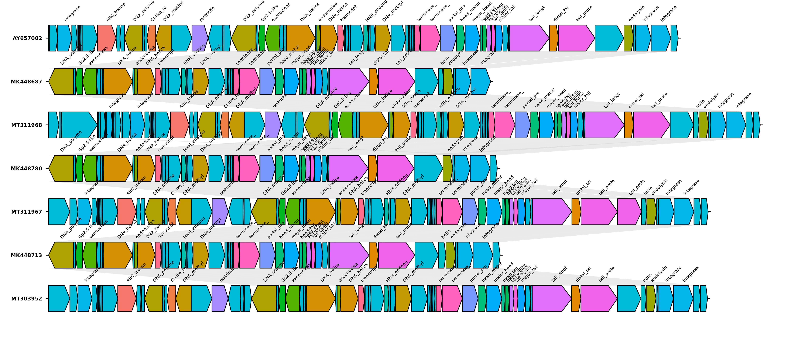
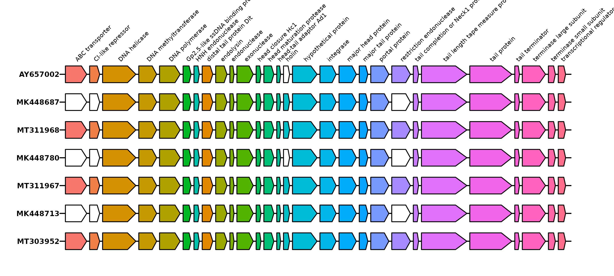

# GenePlot
`GenePlot` is a [gggenomes](https://thackl.github.io/gggenomes/) based lightweight bioinformatics pipeline for **comparative visualization of genes** across multiple genomic segments.  It automates the process of extracting coding sequences from gff files, aligning homologous genes, and generating **comparative gene plots** to highlight synteny and structural variations. The order of the genomic regions is determined by shared genomic content (SGC = ANI x shared region /2). 

Gene synteny plot (with original order of the genes)
<div align="center">
  
</div>

Gene synteny plot (with gene ordered by non-duplicated names. This plot helps easily detect missing genes (white))
<div align="center">
  
</div>

---
## Installation
To install and set up genePlot, follow these steps:

1. Clone the repository:
   ```bash
   git clone https://github.com/your-repo/genePlot.git
   ```
2. Navigate to the project directory:
   ```bash
   cd genePlot
   ```
3. Make the scripts executable:
   ```bash
   chmod +x installation.sh
   chmod +x ./ContigClass.sh
   ```

4. Run the installation script:
	```bash
	conda env create -f scripts/environment.yml
	conda activate genePlot
	```

## Usage
```bash
Usage: ./genePlot.sh --help

### Options:
-d, --data_dir   <directory>     Input data directory (*.gff)
-o, --output_dir  <directory>     Output directory
-c, --cpus        <number>       Number of CPUs to use (optional, default: 4)

### Example
```bash
./genePlot.sh -d /path/to/gff/files -o /path/to/output -c 4
```

---
### Results
After running the script, you will find the following files in the specified output folder

---
🧑‍💻 Author: Swapnil Doijad (swapnil.doijad@gmail.com)  
🙋 Support If you encounter bugs or have feature requests, please open an issue.